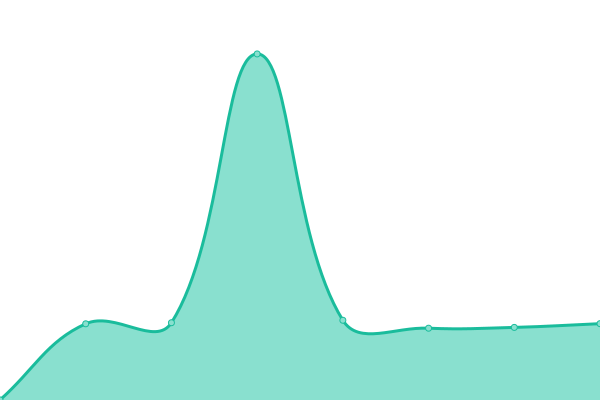

# [📈 Live Status](https://kominfo-denpasar.github.io/status-website): <!--live status--> **🟩 All systems operational**

This repository contains the open-source uptime monitor and status page for [Kominfos Denpasar](https://kominfostatistik.denpasarkota.go.id), powered by [Upptime](https://github.com/upptime/upptime).

With [Upptime](https://upptime.js.org), you can get your own unlimited and free uptime monitor and status page, powered entirely by a GitHub repository. We use [Issues](https://github.com/kominfo-denpasar/status-website/issues) as incident reports, [Actions](https://github.com/kominfo-denpasar/status-website/actions) as uptime monitors, and [Pages](https://kominfo-denpasar.github.io/status-website) for the status page.

<!--start: status pages-->
<!-- This summary is generated by Upptime (https://github.com/upptime/upptime) -->
<!-- Do not edit this manually, your changes will be overwritten -->
<!-- prettier-ignore -->
| URL | Status | History | Response Time | Uptime |
| --- | ------ | ------- | ------------- | ------ |
|  [SIMAKDIHATI](https://simpeg.denpasarkota.go.id) | 🟩 Up | [simakdihati.yml](https://github.com/kominfo-denpasar/status-website/commits/HEAD/history/simakdihati.yml) | 

 1914ms
     
 | 

<a href="https://kominfo-denpasar.github.io/status-website/history/simakdihati">100.00%</a>
    

|  [DIVOS](https://divos.denpasarkota.go.id) | 🟩 Up | [divos.yml](https://github.com/kominfo-denpasar/status-website/commits/HEAD/history/divos.yml) | 

 2147ms
     
 | 

<a href="https://kominfo-denpasar.github.io/status-website/history/divos">96.96%</a>
    

|  [SPBE](https://spbe.denpasarkota.go.id) | 🟩 Up | [spbe.yml](https://github.com/kominfo-denpasar/status-website/commits/HEAD/history/spbe.yml) | 

 3047ms
     
 | 

<a href="https://kominfo-denpasar.github.io/status-website/history/spbe">93.65%</a>
    

|  [TemanRita](https://temanrita.denpasarkota.go.id) | 🟩 Up | [teman-rita.yml](https://github.com/kominfo-denpasar/status-website/commits/HEAD/history/teman-rita.yml) | 

 2923ms
     
 | 

<a href="https://kominfo-denpasar.github.io/status-website/history/teman-rita">93.88%</a>
    

|  [Development (Proxy 2)](https://dev.denpasarkota.go.id) | 🟩 Up | [development-proxy-2.yml](https://github.com/kominfo-denpasar/status-website/commits/HEAD/history/development-proxy-2.yml) | 

 3143ms
     
 | 

<a href="https://kominfo-denpasar.github.io/status-website/history/development-proxy-2">99.77%</a>
    

|  [e-Sign (Proxy 1)](https://esign.denpasarkota.go.id) | 🟩 Up | [e-sign-proxy-1.yml](https://github.com/kominfo-denpasar/status-website/commits/HEAD/history/e-sign-proxy-1.yml) | 

 2281ms
     
 | 

<a href="https://kominfo-denpasar.github.io/status-website/history/e-sign-proxy-1">99.77%</a>
    

<!--end: status pages-->

[**Visit our status website →**](https://kominfo-denpasar.github.io/status-website)

## 📄 License

- Powered by: [Upptime](https://github.com/upptime/upptime)
- Code: [MIT](./LICENSE) © [Anand Chowdhary](https://anandchowdhary.com), supported by [Pabio](https://pabio.com)
- Data in the `./history` directory: [Open Database License](https://opendatacommons.org/licenses/odbl/1-0/)
